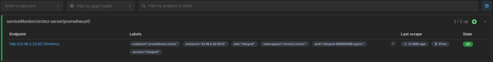
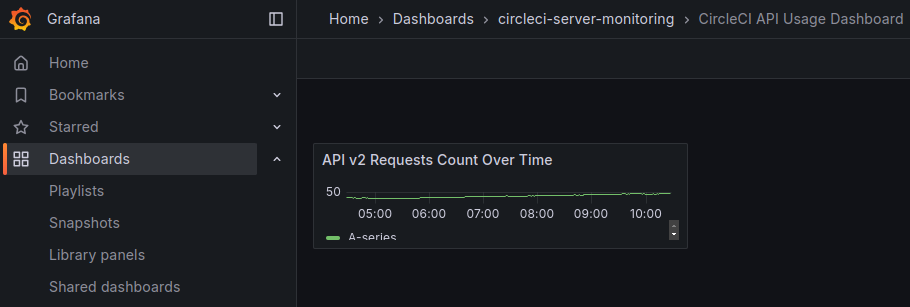

# circleci-server-monitoring-reference
A reference for tools, configurations, and documentation used to monitor CircleCI server.

🚧 **Under Development**

This repository is currently under active development and is not yet a supported resource. Please refer to it at your own discretion until further notice.

## Table of Contents

- [Installing the Monitoring Stack](#installing-the-monitoring-stack)
- [Modifying or Adding Grafana Dashboards](#modifying-or-adding-grafana-dashboards)
- [Helm Values](#values)
- [Helm Releases](#releases)

# server-monitoring-stack

A reference Helm chart for setting up a monitoring stack for CircleCI server


## Installing the Monitoring Stack

## Requirements

| Repository | Name | Version |
|------------|------|---------|
| https://grafana.github.io/helm-charts | grafanaoperator(grafana-operator) | v5.18.0 |
| https://prometheus-community.github.io/helm-charts | prometheusOperator(prometheus-operator-crds) | 19.0.0 |

### 1. Configure Server for the Monitoring Stack

#### Metrics

To set up monitoring for a CircleCI server instance, you need to configure Telegraf to set up a Prometheus client and expose a metrics endpoint. Add the following configuration to the CircleCI **server** Helm chart values:

```yaml
telegraf:
  config:
    outputs:
      - file:
          files: ["stdout"]
      - prometheus_client:
          listen: ":9273"
```

#### Tracing

To setup trace support for a CircleCI server instance you will need to configure the OpenTelemetry collector to consume trace data and export it to the tempo deployment of the monitoring tack. Add the following configuration to the CircleCI **server** Helm chart values:

```yaml
opentelemetry-collector:
    config:
        exporters:
            otlp:
                endpoint: << your Tempo deployment DNS here >>
            tls:
                insecure: true
        service:
            pipelines:
                traces:
                    receivers: ["otlp"]
                    processors: ["filters/traces_lowSignal", "batch"]
                    exporters: ["otlp"]
```

The Tempo deployment DNS will follow the standard kubernetes DNS structure of `<deployment name>.<deployment-namespace>.svc.cluster.local`. By default the deployment will listen on port `4317` for incoming trace data.

Further details for how to configure the OpenTelemetry collector for tracing may be found in the [OpenTelemetry Collector Helm Chart documentation](https://github.com/open-telemetry/opentelemetry-helm-charts/tree/main/charts/opentelemetry-collector)

**Note**
This tracing configuration is supported for server 4.9+. If using server <= 4.8 please refer to the [telegraf documentation](https://github.com/influxdata/telegraf/tree/master/plugins/outputs/opentelemetry) for how to configure trace collection.

### 3. Add Helm Repository

First, add the CircleCI Server Monitoring Stack Helm repository:
```bash
$ helm repo add server-monitoring-stack https://packagecloud.io/circleci/server-monitoring-stack/helm
$ helm repo update
```

### 3. Install Dependencies

Before installing the full chart, you must first install the dependency subcharts and operators.

#### 3.1 Install Prometheus CRDs and Grafana Operator

Install the Prometheus Custom Resource Definitions (CRDs) and the Grafana operator chart. This assumes you are installing it in the same namespace as your CircleCI server installation:

```bash
$ helm install server-monitoring-stack server-monitoring-stack/server-monitoring-stack --set global.enabled=false --set prometheusOperator.installCRDs=true --version 0.1.0-alpha.9 -n <your-server-namespace>
```

> **_NOTE:_** It's possible to install the monitoring stack in a different namespace than the CircleCI server installation. If you do so, set the `prometheus.serviceMonitor.selectorNamespaces` value with the target namespace.

#### 3.2 Install Tempo Operator (Optional)

If you plan to enable distributed tracing with Tempo (`tempo.enabled=true`), you must manually install the Tempo Operator. There is currently no official Helm chart available for the Tempo Operator or its CRDs, so manual installation is required. The Tempo Operator also requires cert-manager to be installed in your cluster. Additionally, this reference chart requires the `grafanaOperator` feature gate to be enabled for proper integration with Grafana.

For more detailed installation instructions, refer to the [official Tempo Operator documentation](https://grafana.com/docs/tempo/latest/setup/operator/#installation).

**Prerequisites:**
- cert-manager must be installed in your cluster

**Example installation steps:**

1. Install the Tempo Operator:
```bash
$ kubectl apply -f https://github.com/grafana/tempo-operator/releases/download/v0.17.0/tempo-operator.yaml
```
2. Enable the `grafanaOperator` feature gate (required for integration with Grafana):
```bash
$ kubectl get cm tempo-operator-manager-config -n tempo-operator-system -o yaml | \
    sed 's/^  *grafanaOperator: false$/      grafanaOperator: true/' | \
    kubectl apply -f -
```
3. Restart the operator deployment to apply the configuration:
```bash
$ kubectl rollout restart deployment/tempo-operator-controller -n tempo-operator-system
$ kubectl wait --for=condition=available --timeout=120s deployment/tempo-operator-controller -n tempo-operator-system
```

### 4. Install the Helm Chart

Next, install the Helm chart using the following command:

```bash
$ helm upgrade --install server-monitoring-stack server-monitoring-stack/server-monitoring-stack --reset-values --version 0.1.0-alpha.9 -n <your-server-namespace>
```

### 5. Verify Prometheus Is Up and Targeting Telegraf
To verify that Prometheus is working correctly and targeting Telegraf, use the following command to port-forward Prometheus:

```bash
$ kubectl port-forward svc/server-monitoring-prometheus 9090:9090 -n <your-namespace-here>
```

Then visit http://localhost:9090/targets in your browser. Verify that Telegraf appears as a target and that its state is "up".



### 6. Verify Grafana Is Up and Connected to Prometheus

To verify that Grafana is working correctly and connected to Prometheus, use the following command to port-forward Grafana:
```bash
$ kubectl port-forward svc/server-monitoring-grafana-service 3000:3000 <your-namespace-here>
```

Then visit http://localhost:3000 in your browser. Once logged in with the default credentials, navigate to http://localhost:3000/dashboards and verify that the default dashboards are present and populating with data.



### 7. Next Steps

After ensuring both Prometheus and Grafana are operational, consider these enhancements:

#### Security
Secure Grafana by configuring credentials:
```yaml
grafana:
  credentials:
    # Directly set these for quick setups
    adminUser: "admin"
    adminPassword: "<your-secure-password-here>"

    # For production, use a Kubernetes secret to manage credentials securely
    existingSecretName: "<your-secret-here>"
```

#### Expose Grafana Externally

For external access, modify the service or ingress values. For example:
```yaml
grafana:
  service:
    type: LoadBalancer
```

#### Enabling Persistent Storage

Persist data by enabling storage for Prometheus and Grafana:
```yaml
prometheus:
  persistence:
    enabled: true
    storageClass: <your-custom-storage-class>
grafana:
  persistence:
    enabled: true
    storageClass: <your-custom-storage-class>
```
> **_NOTE:_** Use a custom storage class with a 'Retain' policy to allow for data retention even after uninstalling the chart.

#### Tempo Storage Configuration

When Tempo is enabled, it's recommended to use object storage instead of in-memory storage for trace persistence. Compatible storage backends for Tempo and CircleCI server include S3, GCS, and MinIO.

Configure object storage using the `tempo.storage` values detailed in the [values](#Values) section below.

> **_NOTE:_** For production deployments, object storage provides better durability and scalability compared to in-memory storage, which loses traces on pod restarts.

For detailed configuration options, consult the [official Tempo documentation](https://grafana.com/docs/tempo/latest/setup/operator/object-storage/).

## Modifying or Adding Grafana Dashboards

The default dashboards are located in the `dashboards` directory of the reference chart. To add new dashboards or modify existing ones, follow these steps.

Dashboards are provisioned directly from CRDs, which means any manual edits will be lost upon a refresh. As such, the workflow outlined below is recommended for making changes:

1. **Create a Copy**:
   - Select **Edit** in the upper right corner.
   - Choose **Save dashboard** -> **Save as copy**.
   - After saving, navigate to the copy.
2. **Make Edits**:
   - Modify the copy as needed and exit edit mode.
3. **Export as JSON**:
   - Select **Export** in the upper right corner and then **Export as JSON**.
   - **Ensure that `Export the dashboard to use in another instance` is toggled on.**
4. **Update the JSON File**:
   - Download the file and replace the `./dashboards/server-slis.json` file with the updated copy.
   - Run the following command to automatically validate the JSON and apply necessary updates:
     ```bash
     ./do validate-dashboards
     ```
5. **Commit and Open a PR**:
   - Review and commit the changes.
   - Open a pull request for the On-Prem team to review.

## Values

| Key | Type | Default | Description |
|-----|------|---------|-------------|
| global.enabled | bool | `true` |  |
| global.fullnameOverride | string | `"server-monitoring"` | Override the full name for resources |
| global.imagePullSecrets | list | `[]` | List of image pull secrets to be used across the deployment |
| global.nameOverride | string | `""` | Override the release name |
| grafana.credentials.adminPassword | string | `"admin"` | Grafana admin password. Change from default for production environments. |
| grafana.credentials.adminUser | string | `"admin"` | Grafana admin username. |
| grafana.credentials.existingSecretName | string | `""` | Name of an existing secret for Grafana credentials. Leave empty to create a new secret. |
| grafana.dashboards.jsonDirectory | string | `"dashboards"` | The directory containing JSON files for Grafana dashboards. |
| grafana.datasource.jsonData.timeInterval | string | `"5s"` | The time interval for Grafana to poll Prometheus. Specifies the frequency of data requests. |
| grafana.enabled | string | `"-"` |  |
| grafana.extraConfig | string | `""` | Add any custom Grafana configurations you require here. This should be a YAML-formatted string of additional settings for Grafana. |
| grafana.image.repository | string | `"grafana/grafana"` | Image repository for Grafana. |
| grafana.image.tag | string | `"12.0.0-security-01"` | Tag for the Grafana image. |
| grafana.ingress.className | string | `""` | Specifies the class of the Ingress controller. Required if the Kubernetes cluster includes multiple Ingress controllers. |
| grafana.ingress.enabled | bool | `false` | Enable to create an Ingress resource for Grafana. Disabled by default. |
| grafana.ingress.host | string | `""` | Hostname to use for the Ingress. Must be set if Ingress is enabled. |
| grafana.ingress.tls.enabled | bool | `false` | Enable TLS for Ingress. Requires a TLS secret to be specified. |
| grafana.ingress.tls.secretName | string | `""` | Name of the TLS secret used for securing the Ingress. Must be provided if TLS is enabled. |
| grafana.persistence.accessModes | list | `["ReadWriteOnce"]` | Access modes for the persistent volume. |
| grafana.persistence.enabled | bool | `false` | Enable persistent storage for Grafana. |
| grafana.persistence.size | string | `"10Gi"` | Size of the persistent volume claim. |
| grafana.persistence.storageClass | string | `""` | Storage class for persistent volume provisioner. You can create a custom storage class with a "retain" policy to ensure the persistent volume remains even after the chart is uninstalled. |
| grafana.replicas | int | `1` | Number of Grafana replicas to deploy. |
| grafana.service.annotations | object | `{}` | Metadata annotations for the service. |
| grafana.service.port | int | `3000` | Port on which the Grafana service will be exposed. |
| grafana.service.type | string | `"ClusterIP"` | Specifies the type of service for Grafana. Options include ClusterIP, NodePort, or LoadBalancer. Use NodePort or LoadBalancer to expose Grafana externally. Ensure that grafana.credentials are set for security purposes. |
| grafanaoperator | object | `{"fullnameOverride":"server-monitoring-grafana-operator","image":{"repository":"quay.io/grafana-operator/grafana-operator","tag":"v5.18.0"}}` | Full values for the Grafana Operator chart can be obtained at: https://github.com/grafana/grafana-operator/blob/master/deploy/helm/grafana-operator/values.yaml |
| grafanaoperator.fullnameOverride | string | `"server-monitoring-grafana-operator"` | Overrides the fully qualified app name. |
| grafanaoperator.image.repository | string | `"quay.io/grafana-operator/grafana-operator"` | Image repository for the Grafana Operator. |
| grafanaoperator.image.tag | string | `"v5.18.0"` | Tag for the Grafana Operator image. |
| prometheus.enabled | string | `"-"` |  |
| prometheus.image.repository | string | `"quay.io/prometheus/prometheus"` | Image repository for Prometheus. |
| prometheus.image.tag | string | `"v3.2.1"` | Tag for the Prometheus image. |
| prometheus.persistence.accessModes | list | `["ReadWriteOnce"]` | Access modes for the persistent volume. |
| prometheus.persistence.enabled | bool | `false` | Enable persistent storage for Prometheus. |
| prometheus.persistence.size | string | `"10Gi"` | Size of the persistent volume claim. |
| prometheus.persistence.storageClass | string | `""` | Storage class for persistent volume provisioner. You can create a custom storage class with a "retain" policy to ensure the persistent volume remains even after the chart is uninstalled. |
| prometheus.replicas | int | `2` | Number of Prometheus replicas to deploy. |
| prometheus.serviceMonitor.endpoints[0].metricRelabelings[0].action | string | `"labeldrop"` |  |
| prometheus.serviceMonitor.endpoints[0].metricRelabelings[0].regex | string | `"instance"` |  |
| prometheus.serviceMonitor.endpoints[0].port | string | `"prometheus-client"` | Port name for the Prometheus client service. |
| prometheus.serviceMonitor.endpoints[0].relabelings[0].action | string | `"labeldrop"` |  |
| prometheus.serviceMonitor.endpoints[0].relabelings[0].regex | string | `"(container|endpoint|namespace|pod|service)"` |  |
| prometheus.serviceMonitor.selectorExpressions | list | `[{"key":"app.kubernetes.io/name","operator":"In","values":["telegraf","tempo"]}]` | Match ServiceMonitors with specific names |
| prometheus.serviceMonitor.selectorLabels | object | `{"app.kubernetes.io/instance":"circleci-server"}` | Labels to select ServiceMonitors for scraping metrics. By default, it's configured to scrape the existing Telegraf and Tempo deployments in CircleCI server. |
| prometheus.serviceMonitor.selectorNamespaces | list | `[]` | Namespaces to look for ServiceMonitor objects. Set this if the CircleCI server monitoring stack is deploying in a different namespace than the actual CircleCI server installation. |
| prometheusOperator.crds.annotations."helm.sh/resource-policy" | string | `"keep"` |  |
| prometheusOperator.enabled | string | `"-"` |  |
| prometheusOperator.image.repository | string | `"quay.io/prometheus-operator/prometheus-operator"` | Image repository for Prometheus Operator. |
| prometheusOperator.image.tag | string | `"v0.81.0"` | Tag for the Prometheus Operator image. |
| prometheusOperator.installCRDs | bool | `false` |  |
| prometheusOperator.prometheusConfigReloader.image.repository | string | `"quay.io/prometheus-operator/prometheus-config-reloader"` | Image repository for Prometheus Config Reloader. |
| prometheusOperator.prometheusConfigReloader.image.tag | string | `"v0.81.0"` | Tag for the Prometheus Config Reloader image. |
| prometheusOperator.replicas | int | `1` | Number of Prometheus Operator replicas to deploy. |
| tempo.enabled | string | `"-"` | Enable Tempo distributed tracing Requires manual installation of Tempo Operator Set to true to enable, false to disable, "-" to use global default |
| tempo.extraConfig | object | `{}` | Add any custom Tempo configurations you require here. This should be a YAML object of additional settings for Tempo. |
| tempo.podSecurityContext | object | `{"fsGroup":10001,"runAsGroup":10001,"runAsNonRoot":true,"runAsUser":10001}` | Pod security context for Tempo containers |
| tempo.podSecurityContext.fsGroup | int | `10001` | Filesystem group ID for volume ownership and permissions |
| tempo.podSecurityContext.runAsGroup | int | `10001` | Group ID to run the container processes |
| tempo.podSecurityContext.runAsNonRoot | bool | `true` | Run containers as non-root user |
| tempo.podSecurityContext.runAsUser | int | `10001` | User ID to run the container processes |
| tempo.resources | object | `{"limits":{"cpu":"1000m","memory":"2Gi"},"requests":{"cpu":"500m","memory":"1Gi"}}` | Resource requirements for Tempo pods Adjust based on your trace volume and cluster capacity |
| tempo.resources.limits.cpu | string | `"1000m"` | Maximum CPU Tempo pods can use |
| tempo.resources.limits.memory | string | `"2Gi"` | Maximum memory Tempo pods can use |
| tempo.resources.requests.cpu | string | `"500m"` | Minimum CPU guaranteed to Tempo pods |
| tempo.resources.requests.memory | string | `"1Gi"` | Minimum memory guaranteed to Tempo pods |
| tempo.serviceMonitor | object | `{"enabled":true,"endpoints":[{"interval":"30s","path":"/metrics","port":"http"}]}` | Exposes Tempo RED metrics for Prometheus |
| tempo.serviceMonitor.enabled | bool | `true` | Enable ServiceMonitor creation for Tempo metrics |
| tempo.serviceMonitor.endpoints | list | `[{"interval":"30s","path":"/metrics","port":"http"}]` | Endpoints configuration for metrics scraping |
| tempo.storage | object | `{"traces":{"backend":"memory","size":"20Gi","storageClassName":""}}` | Storage configuration for trace data |
| tempo.storage.traces.backend | string | `"memory"` | Storage backend for traces Default: in-memory storage (traces lost on pod restart) Suitable for development/testing environments only |
| tempo.storage.traces.size | string | `"20Gi"` | Storage volume size For memory/pv: actual volume size For cloud backends: size of WAL (Write-Ahead Log) volume Increase for higher trace volumes or longer retention |
| tempo.storage.traces.storageClassName | string | `""` | Storage class for persistent volume provisioner. Applies to both persistent volume and object storage backends. |

## Releases

Releases are managed by the CI/CD pipeline on the main branch, with an approval job gate called `approve-deploy-chart`. Before releasing, increment the Helm chart version in `Chart.yaml` and regenerate the documentation using `./do helm-docs`. Once approved, the release will be available in the [package repository](https://packagecloud.io/circleci/server-monitoring-stack).

# Server Monitoring Reference Support Policy

This monitoring reference is not part of CircleCI’s Server product. CircleCI provides it as a monitoring tooling and configuration repository for CircleCI Server User(s) that may be referred to when the User(s) plan and deploy their own monitoring implementations.

CircleCI strives to ensure that the monitoring tooling and configurations in this reference are functional and up to date. While CircleCI may provide reference to, answer questions regarding, and/or review contributions to the monitoring tooling and configurations, CircleCI does not make any judgment or recommendation as to the suitability for any customer installation of them with CircleCI Server, nor provide support for their installation and/or management in any customer’s system.

**This monitoring reference and the monitoring tooling and configurations are provided on an ‘as-is’ and ‘as available’ basis without any warranties of any kind. CircleCI disclaims all warranties, express or implied, including, but not limited to, all implied warranties of merchantability, title, fitness for a particular purpose, and noninfringement.**
